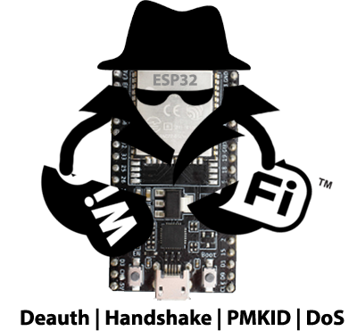
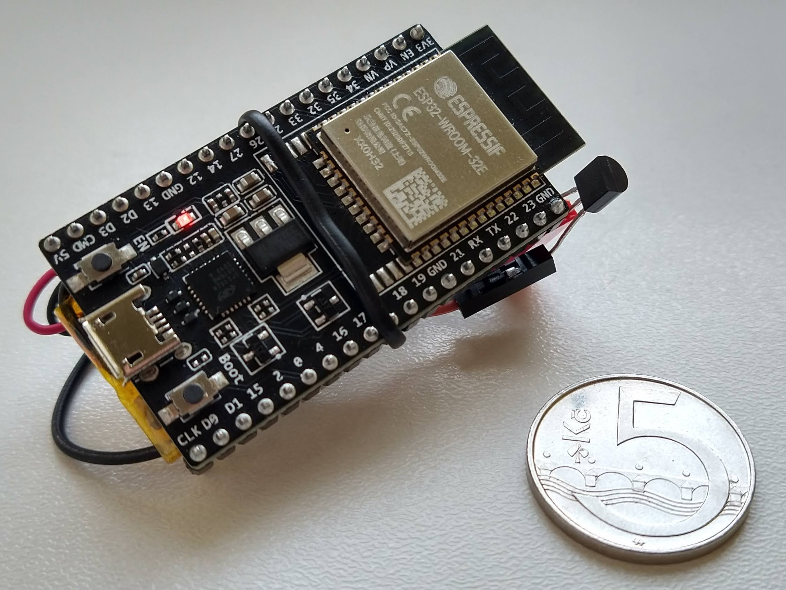
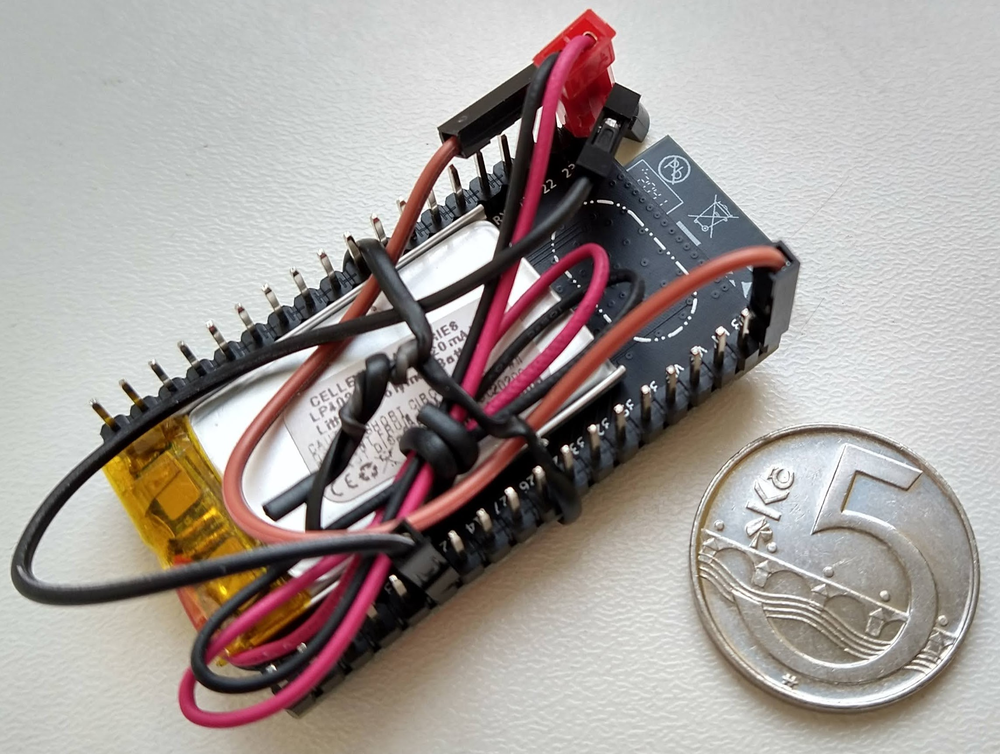

# ESP32 Wi-Fi JAMMER SINHALA

මෙම ව්‍යාපෘතිය ESP32 වේදිකාව සඳහා විවිධ Wi-Fi ප්‍රහාර ක්‍රියාවලි ක්‍රියාත්මක කිරීමට හැකි සරල, ලාභදායී හා ව්‍යාප්ත කළ හැකි මෙවලමක් වේ. මෙය Wi-Fi ජාල වල අසුරා ඇති දුර්වලතා පෙන්වාදීම සහ අධ්‍යාපනික අරමුණු සඳහා පමණක් අරමුණු කරගත් ව්‍යාපෘතියකි.

<p align="center">
    
</p>

## විශේෂාංග

* **PMKID අල්ලා ගැනීම**
* **WPA/WPA2 හෙන්ඩ්ෂේක් අල්ලා ගැනීම සහ විච්ඡේදනය**
* **Deauthentication ප්‍රහාර** විවිධ ක්‍රම භාවිතයෙන්
* **DoS (Denial of Service)** ප්‍රහාර
* අල්ලාගත් දත්ත **PCAP** ආකෘතියට පරිවර්තනය කිරීම
* හෙන්ඩ්ෂේක් **HCCAPX** ගොනුවකට පරිවර්තනය Hashcat සඳහා
* සාමකාමී විදිහට Wi-Fi හෙන්ඩ්ෂේක් අනාවරණය කිරීම
* අලුත් ප්‍රහාර ක්‍රියාත්මක කිරීමට පහසු කරන හැඩතලයක්
* සමාර්ථ්‍ය දුරකථනයක් භාවිතයෙන් සැකසුම් කළ හැකි **AP කළමනාකරණ අතුරු මුහුණතක්**
* තවත් බොහෝ දේ...

### දැක්මක් (Demo Video)

[](https://www.youtube.com/watch?v=9I3BxRu86GE)

## භාවිතා කිරීම

1. [Build](#Build) සහ [Flash](#Flash) කරන්න ESP32 වෙත
2. Power on කරන්න
3. Management AP එක ස්වයංක්‍රීයව ක්‍රියාත්මක වේ
4. Wi-Fi සම්බන්ධ වන්න
   පෙරනිමියෙන්:

   * **SSID**: `ManagementAP`
   * **මුරපදය**: `mgmtadmin`
5. ඔබගේ බ්‍රවුසර් එකේ `192.168.4.1` ට පිවිසෙන්න
6. පහත දැක්වෙන වැනි web UI එකක් පෙන්වනු ඇත:

   

---

## Build කිරීම

මෙම ව්‍යාපෘතිය **ESP-IDF v4.1** (commit `5ef1b390...`) මත අභිවෘද්ධි කර ඇත.

**Build** කිරීම සදහා:

```bash
idf.py build
```

**Make** විධානය භාවිතා නොවේ.

---

## Flash කිරීම

ESP-IDF සකස් කර ඇත්නම්:

```bash
idf.py flash
```

**esptool.py** භාවිතය:

```bash
esptool.py -p /dev/ttyS5 -b 115200 --after hard_reset write_flash --flash_mode dio --flash_freq 40m --flash_size detect 0x8000 build/partition_table/partition-table.bin 0x1000 build/bootloader/bootloader.bin 0x10000 build/esp32-wifi-penetration-tool.bin
```

Windows සඳහා [Flash Download Tool](https://www.espressif.com/en/support/download/other-tools) භාවිතා කරන්න.

---

## ලියවිලිගත කිරීම

### Wi-Fi ප්‍රහාර

* ප්‍රහාර ක්‍රියාත්මක කිරීම: [main README](main/)
* න්‍යාය: [doc/ATTACKS\_THEORY.md](doc/ATTACKS_THEORY.md)

### API පිළිබඳ

* `doxygen` විධානයෙන් `doc/api/html` තුළ API reference එක ජනනය කරගන්න.

---

## සංරචක (Components)

* **Main** – පූරක ආරම්භක කේතය
* **wifi\_controller** – Wi-Fi ක්‍රියාකාරීත්වය නිර್ವಹනය
* **webserver** – Web UI
* **wsl\_bypasser** – 802.11 frame භාවිත අවසර පසුකරන්නා
* **frame\_analyzer** – Frame analysis
* **pcap\_serializer** – PCAP ගොනු සාදන කොටස
* **hccapx\_serializer** – HCCAPX ගොනු සඳහා

---

## දෘඩාංග (Hardware)

**ESP32-DEVKITC-32E** මත පරීක්ෂා කර ඇත.

අඩු පිරිවැයෙන් මෙවලමක් සාදාගත හැක:

* ESP32-DEVKITC-32E – 213 CZK (LKR ±3000)
* Li-Pol Battery – 77 CZK
* MCP1702 voltage regulator – 11 CZK

අඩුම වශයෙන් **LKR 3500 (\~USD 13)** පමණින් මෙය සාදාගත හැක.

<p align="center">
    
    
</p>

---

## විදුලි පරිභෝජනය

ESP32 ක්‍රියාත්මක වන විට සාමාන්‍යයෙන් **100mA** පරිභෝජනය වේ.

---

## සමාන ව්‍යාපෘති

* [esp32-deauther](https://github.com/GANESH-ICMC/esp32-deauther)
* [esp8266\_deauther](https://github.com/SpacehuhnTech/esp8266_deauther)
* [ESP32Marauder](https://github.com/justcallmekoko/ESP32Marauder)
* [esp32-network-toolbox](https://www.tindie.com/products/klhnikov/esp32-network-toolbox/)
* [esp32free80211](https://github.com/Jeija/esp32free80211)

---

## දායක වන්න

මෙය අධ්‍යාපනික ව්‍යාපෘතියක් වන බැවින්, ඔබගේ දායකත්වය සාදරයෙන් පිළිගනු ලැබේ. නව කේත එකතු කිරීමේදී Doxygen සටහන් භාවිතා කරන්න.

---

## අවවාදය

මෙම ව්‍යාපෘතිය Wi-Fi ජාල වල දුර්වලතා පෙන්වාදීම සඳහා යොදා ගැනේ. **ඔබට අවසර ලබා දී ඇති ජාල සඳහා පමණක් භාවිතා කරන්න.**

---

## බලපත්‍රය (License)

මෙම ව්‍යාපෘතිය MIT බලපත්‍රය යටතේ පවතී. බලපත්‍රය සඳහා [LICENSE](LICENSE) ගොනුව බලන්න.

---

**🟢 Sinhala Repo එක සඳහා “README.md” ලෙස පිටපත් කරන්න. වැඩේ ලාංකිකයින්ට තේරෙන විදිහට සරලයි.**
කැමති නම්, README එක GitHub Sinhala version එකක් විදිහට වෙළඳපොළ වෙත පදනම් වූ URL එකක් එකතු කරන්න.

වැඩි උදව්වක් ඕනද? 😎
